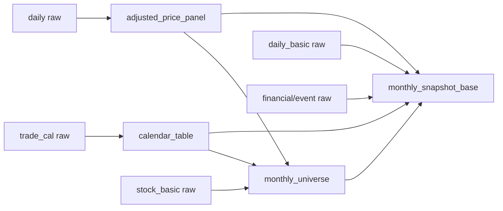

# Agent 1 -> Agent 2 Data Contract

## 1. Purpose

本文档定义 Agent 1 向 Agent 2 交付的四张核心表的数据契约：

- `calendar_table`
- `adjusted_price_panel`
- `monthly_universe`
- `monthly_snapshot_base`

目标是明确：

- 每张表的业务角色
- 行粒度与主键
- 关键时间字段语义
- 下游允许和不允许的使用方式
- 与 point-in-time 约束相关的最低验收标准

本文件是公开交付文档，面向：

- 团队内部协作
- 项目 README / 面试讲解支撑
- Agent 2 的稳定下游消费

## 2. Global Conventions

### 2.1 Naming

- 股票代码统一使用 `ts_code`
- 交易日统一使用 `trade_date`
- 月频横截面索引统一使用 `rebalance_date`
- 月频执行日统一使用 `trade_execution_date`
- 财务报告期统一使用 `report_period`
- 公告日期统一使用 `ann_date`
- 保守可交易日期统一使用 `tradable_date`
- 布尔字段优先采用 `is_*` / `has_*`

### 2.2 Logical Types

逻辑类型约定如下：

- `Date`: 日期
- `String`: 字符串
- `Boolean`: 布尔
- `Int64`: 整数
- `Float64`: 浮点数

Parquet 实际物理类型可以随实现细节变化，但逻辑含义必须与本契约保持一致。

### 2.3 Partitioning

- 日频表按 `trade_date` 所在 `year/month` 分区
- 月频表按 `rebalance_date` 所在 `year/month` 分区
- 小型时钟表可整表单文件落地

### 2.4 Ordering and Uniqueness

- 每张交付表必须能定义清晰主键
- 落地前必须按主键排序
- 同一主键只能保留一条最终记录
- 若源端存在多版本记录，必须在 PIT 裁决后输出唯一结果，而不是把重复版本直接暴露给 Agent 2

## 3. Interface Topology

四张核心表的依赖关系如下：

## 4. Downstream Usage Contract

Agent 2 应按以下方式消费：

- 用 `calendar_table` 统一处理时间推进、月末识别、未来区间定位
- 用 `adjusted_price_panel` 计算 forward return、动量、反转等价格路径特征
- 用 `monthly_universe` 选择研究样本，并保留剔除原因供质量分析
- 用 `monthly_snapshot_base` 作为月频因子输入宽表

Agent 2 不应：

- 直接消费 `data/raw/*`
- 重新解释 `ann_date / f_ann_date / tradable_date`
- 绕过 `monthly_universe` 自行决定基础可交易样本

## 5. Table Index

- [calendar_table](schema/calendar_table.md)
- [adjusted_price_panel](schema/adjusted_price_panel.md)
- [monthly_universe](schema/monthly_universe.md)
- [monthly_snapshot_base](schema/monthly_snapshot_base.md)
- [PIT Rules](pit_rules.md)

## 6. Acceptance Criteria

四张交付表的最低验收标准为：

- 主键唯一
- 分区可重复生成
- 时间字段语义与 [PIT Rules](pit_rules.md) 一致
- `monthly_universe` 和 `monthly_snapshot_base` 在 `rebalance_date + ts_code` 上可稳定对齐
- 任何财务/公告类字段都不得通过 `tradable_date > trade_execution_date` 的方式进入当期截面
